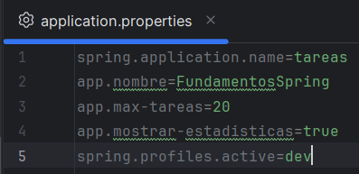

# 🚀 T.P. Fundamentos de Spring Boot: Sistema de Gestión de Tareas

## 🧑‍💻 Información del Autor

| Rol | Dato |
| :--- | :--- |
| **Nombre** | Lautaro Castillo |
| **Legajo** | 52616 |

---

## 📝 Descripción del Proyecto

Este proyecto es una aplicación fundamental de **Spring Boot** que simula un **Sistema de Gestión de Tareas (To-Do List)** en memoria.

El objetivo principal fue aplicar los conceptos básicos y avanzados del *framework*, creando una **arquitectura en capas** (Repository, Service) y utilizando la inyección de dependencias, la configuración dinámica y la gestión de entornos. La lógica de negocio de prueba se ejecuta automáticamente al iniciar la aplicación mediante la interfaz `CommandLineRunner`.

### Principios Fundamentales Aplicados

* **Inyección de Dependencias (DI):** Implementación exclusiva por constructor (`@RequiredArgsConstructor` de Lombok), promoviendo la inmutabilidad y el desacoplamiento.
* **Arquitectura en Capas:** Clara separación de responsabilidades entre el Repositorio (manejo de datos en memoria), el Servicio (lógica de negocio y validación) y la Capa de Ejecución (`CommandLineRunner`).
* **Gestión de Profiles:** Uso de archivos de configuración separados y *Beans* condicionales para diferenciar completamente el comportamiento entre los entornos `dev` y `prod`.

---

## 🛠️ Tecnologías Utilizadas

| Tecnología | Propósito |
| :--- | :--- |
| **Java 17+** | Lenguaje de programación. |
| **Spring Boot 3.x** | Framework para la construcción de la aplicación. |
| **Maven** | Herramienta para la gestión de dependencias y construcción. |
| **Lombok** | Librería para la reducción de código repetitivo (getters, setters, constructores). |

---

## ⚙️ Instrucciones para Clonar y Ejecutar el Proyecto

El proyecto se ejecuta mediante Spring Boot y Maven. El *profile* por defecto es `dev`.

### 1. Clonar el Repositorio

Abre tu terminal y ejecuta:

```bash
git clone [https://docs.github.com/es/repositories/creating-and-managing-repositories/quickstart-for-repositories](https://docs.github.com/es/repositories/creating-and-managing-repositories/quickstart-for-repositories)
cd [Nombre-de-tu-proyecto]
```
### 2. Ejecutar con Maven
Ejecuta el proyecto directamente usando el plugin de Spring Boot:

```bash
./mvnw spring-boot:run
```

## 🔄 Cómo Cambiar entre Profiles (`dev` / `prod`)

Para probar la configuración de entornos, se debe pasar un argumento de sistema al iniciar la aplicación.


### 1. Ejecución con Profile `dev` (Desarrollo)

Se activa por defecto. Utiliza un límite bajo de tareas (`app.max-tareas=10`), `logging` detallado y **muestra** estadísticas.
### 2. Ejecución con Profile `prod` (Producción)


En el archivo 'application.properties' modificamos el valor de 'spring.profiles.active'
Para utilizar el profile de Producción: 'spring.profiles.active=prod'
---
Conclusiones Personales sobre lo Aprendido
Este Trabajo práctico reforzó mi entendimiento de varios conceptos clave del desarrollo profesional con Spring Boot:

Inyección de Dependencias: La aplicación rigurosa de la inyección por constructor me demostró cómo obtener componentes desacoplados e inmutables, lo cual es esencial para el código mantenible.

Configuración de Entornos Dinámica: El uso de los Profiles de Spring fue fundamental para aprender a adaptar el comportamiento de la aplicación (límites, logs, mensajes) sin modificar el código fuente, un requisito clave en entornos de producción.

Arquitectura Sólida: El ejercicio reforzó la separación de responsabilidades entre el Repositorio (acceso a datos) y el Servicio (lógica de negocio), respetando los estereotipos de Spring (@Repository, @Service).